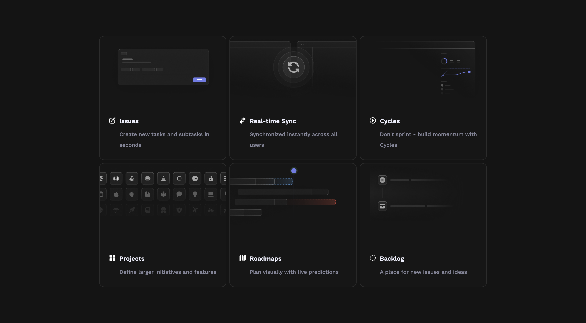

# Hovering Animation with Light Effect 

This is my recreation of the hovering animation from [Linear's website](https://linear.app/features).

## Table of contents

- [Overview](#overview)
  - [The challenge](#the-challenge)
  - [Screenshot](#screenshot)
  - [Links](#links)
- [My process](#my-process)
  - [Built with](#built-with)
  - [What I learned](#what-i-learned)
  - [Building process](#building-process)
  - [Remarks](#remarks)
  - [Continued development](#continued-development)
  - [Useful resources](#useful-resources)
- [Author](#author)

## Overview 

### The challenge

Users should be able to:

- View the optimal layout for the site depending on their device's screen size
- See hover states for all interactive elements on the page

### Screenshot



### Links

- Live Site URL: [Linears Hover Effect](https://gitdoppler.github.io/Linears-Hover-Effect/)

## My process

### Built with

- CSS custom properties
- Flexbox
- Mobile-first workflow

### What I learned

- The usefulness of pseudo-elements (::after + ::before), how they can be used for different kinds of styling.
```html
.fake-border::before {

    content: "";
    border-radius: inherit;
    height: 100%;
    width: 100%;

    position: absolute;
    top: 0px;
    left: 0px;
    z-index: 3;

    background: radial-gradient(800px circle at var(--mouse-x) var(--mouse-y), rgba(255, 255, 255, 0.06), transparent 40%);

    opacity: 0;
    transition: opacity 0.2s ease-in-out;
}
```

```html
.fake-border::after {
    content: "";
    border-radius: inherit;
    height: 100%;
    width: 100%;

    position: absolute;
    top: 0px;
    left: 0px;
    z-index: 1;

    background: radial-gradient(400px circle at var(--mouse-x) var(--mouse-y), rgba(255, 255, 255, 0.3), transparent 40%);

    opacity: 0;
    transition: opacity 0.2s ease-in-out;
}
```

- How to get the position of my cursor (using mouse events).

- The getBoundingClientRect() API which can be used to calculate the distance of a HTML element relative to the (0,0) of the HTML doc.
```js
const options = document.querySelector(".options");
options.addEventListener(("mousemove"), (e) => {
    for (const item of fakeBorders) {
        const rect = item.getBoundingClientRect(),
            x = e.clientX - rect.left,
            y = e.clientY - rect.top;

        item.style.setProperty("--mouse-x", `${x}px`);
        item.style.setProperty("--mouse-y", `${y}px`);
    }
});
```

- Arrow functions and how they work in an event-context.

### Building process

- Define a "fake border" which is actually a div with a grey background and with the z-index:0.
- Define a content box which will hold our content. It will have z-index:2.
- Create a pseudo-element for the fake-border (with a radial gradient background) which will be the main light. This element will afect both the content and the border . z-index:3.
- Create a pseudo-element for the fake-border ( with a bright radial gradient) which will only apply to the border and which will lighten it up.z-index:1.
- Using js we make the pseudo-elements move with our cursor.


### Remarks

I should've started first with the animation (making sure it works flawlesly and correctly). Having it done in reverse, I realized the importance of order and planning ahead (need to work more on this).

### Continued development

To try and recreate more designs ( preferably with as less help as as possible )


### Useful resources

- [Hyperplexed](https://www.youtube.com/watch?v=htGfnF1zN4g&list=WL&index=3) 

## Author

- Frontend Mentor - [@GitDoppler](https://www.frontendmentor.io/profile/GitDoppler)
